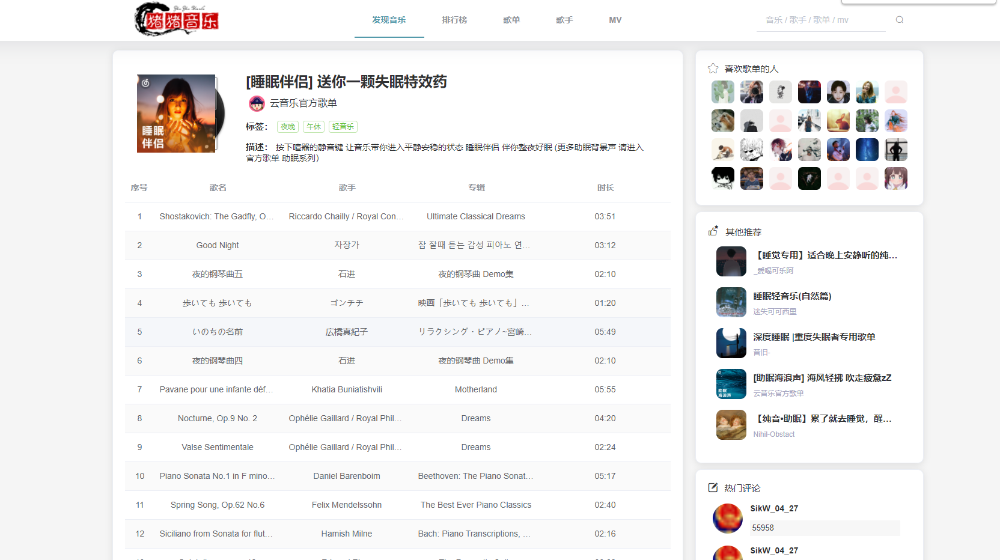
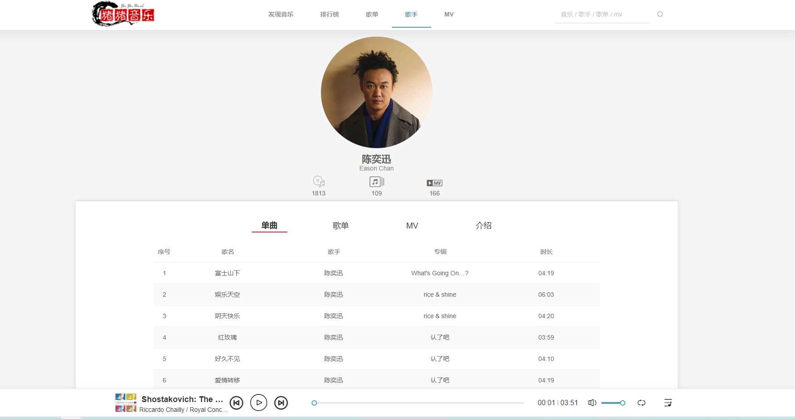
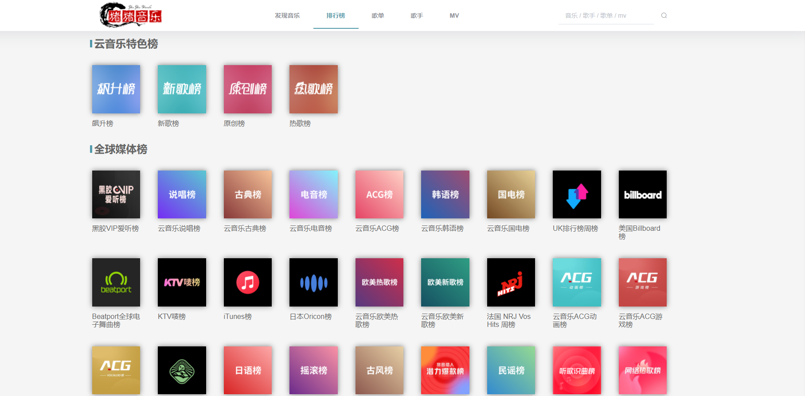
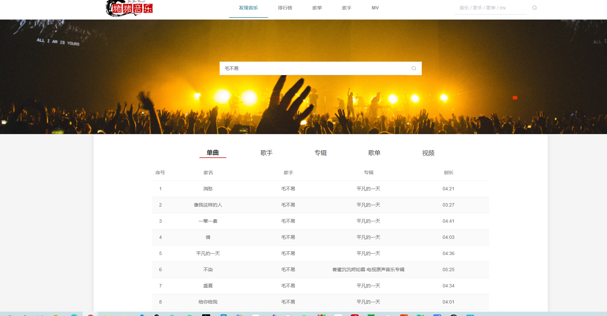

# vue-music仿网易云音乐(Vue + Element-ui)

## 介绍
基于vue的音乐网站(Vue全家桶 + Element-ui)

## 非常感谢

[Binaryify/NeteaseCloudMusicApi](https://github.com/Binaryify/NeteaseCloudMusicApi)

## 预览地址

[vue-music](http://47.98.142.133:80)

#### 演示

##### 首页

 

#####  歌单详情

 

#####  歌手详情

 

#####  mv详情

 

##### 排行榜



##### 歌手分类


##### 搜索页




## 目录结构

##### src:

###### --assets  存放静态资源

###### --components 视图相关组件

###### --network 网络请求

###### --plugins 存放插件(element-ui)

###### --router 路由

###### --store vuex

###### --utils 自定义工具

###### --views 视图


## 安装运行

```shell
克隆
$ git clone git@github.com:/P-J27/vue-music.git
或者
$ git clone git@gitee.com:p_pj/vue-music.git

切到根目录
$ cd front
安装依赖
$ npm install
运行
$ npm run serve
```


#### 参与贡献

1.  Fork 本仓库
2.  新建 Feat_xxx 分支
3.  提交代码
4.  新建 Pull Request

#### 特技

[GitHub](https://github.com/P-J27/vue-music)

[Gitee](https://gitee.com/p_pj/vue-music)

